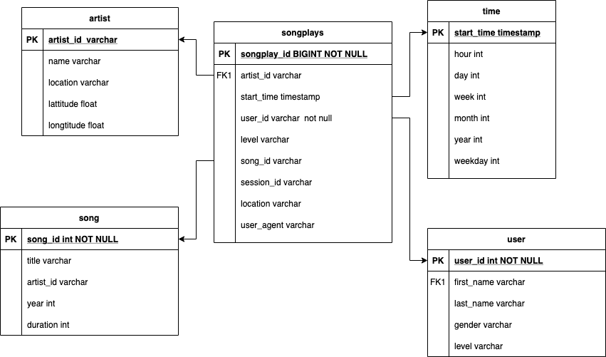

## Introduction

A music streaming startup, Sparkify, has grown their user base and song database and want to move their processes and data onto the cloud. In this project, I will help the team build an ETL pipeline that extracts data from s3, stage them in Redshift and reansforms data into a set of dimensional tables for analyst finding insights about the app usage.

## Data sets

Both datasets reside in AWS S3 bucket.

1. song data set: Each file is in json format, contains metadata about a song and artist of that song.
2. log data set: Each file consists of log files in json format. It includes app activity logs such as length of song, user gender, user name, user membership level, timestamp, browser and etc.

## Database schema

>
Dimension tables:
- songs table: song_id, artist_id, title, year and duration.
- users table: user_id ,first_name, last_name, gender and level
- time table: start_time, day, hour, week, month, year and weekday
- artists table: artist ID, name, location, lattitude, and longitude

Fact tables:
- songplays table: songplay_id, start_time, user_id, level, song_id, artist_id, session_id, location, user_agent
>

The star-schema is like this:

## Project details

- sql_queries.py - This file contains all the SQL statement required in the ETL process, such as create, drop, insert and copy.

- create_tables.py - This file will connect the database, drop the tables if exists and create new tables as ER-diagram shows.

- etl.py - This file covers ETL processes: load data from s3 to staging tables on Redshift and load data from staging tables to analytics tables on Redshift.

- dwh.cfg - This file saves my AWS cluster, s3 and IAM information.

## How to run

1. Run create_tables.py to drop the existed table and create new tables.
2. Run etl.py to execute the tasks in ETL pipeline.